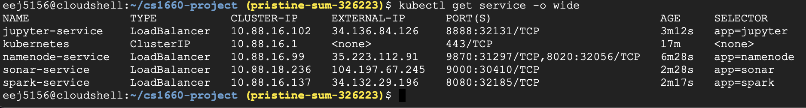
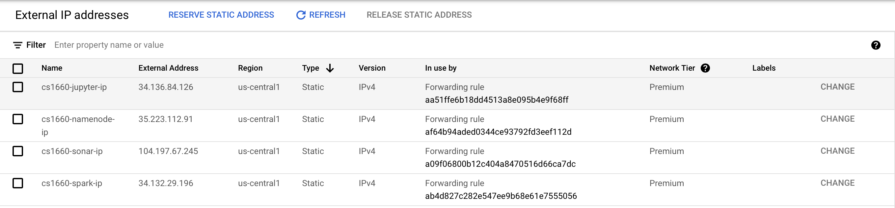

# cs1660-project

## Containers

* [GUI Source Code](cs1660-project-main/gui.py)
* [Apache Hadoop Namenode Docker Hub URL](https://hub.docker.com/layers/bde2020/hadoop-namenode/2.0.0-hadoop3.2.1-java8/images/sha256-51ad9293ec52083c5003ef0aaab00c3dd7d6335ddf495cc1257f97a272cab4c0?context=explore)
* [Apache Hadoop Datanode Docker Hub URL](https://hub.docker.com/layers/bde2020/hadoop-datanode/2.0.0-hadoop3.2.1-java8/images/sha256-ddf6e9ad55af4f73d2ccb6da31d9e3331ffb94d5f046126db4f40aa348d484bf?context=explore)
* [Apache Spark Docker Hub URL](https://hub.docker.com/layers/bitnami/spark/3/images/sha256-e60f9146bdce100cf518746117f84d659d352dc0fc4c0af552e05a935f5d2ae1?context=explore)
* [Jupyter Notebook Docker Hub URL](https://hub.docker.com/r/jupyter/datascience-notebook)
* [SonarQube Docker Hub URL](https://hub.docker.com/_/sonarqube)

## Deploying to a Local Kubernetes Cluster

1. Type git clone https://github.com/erikpitt/cs1660-project.git
2. Type cd cs1660-project
3. Type minikube start
4. Type kubectl apply -f hadoop/namenode-deployment.yaml
5. Type kubectl apply -f hadoop/namenode-service.yaml
6. Type kubectl apply -f hadoop/datanode-deployment.yaml
7. Type kubectl apply -f jupyter/jupyter-deployment.yaml
8. Type kubectl apply -f jupyter/jupyter-service.yaml
9. Type kubectl apply -f sonar/sonar-deployment.yaml
10. Type kubectl apply -f sonar/sonar-service.yaml
11. Type kubectl apply -f spark/spark-deployment.yaml
12. Type kubectl apply -f spark/spark-service.yaml
13. Open another terminal window and type minikube tunnel

## Pods and Services Running on Local Kubernetes Cluster

## Deploying to Google Kubernetes Engine

1. On Google Cloud Platform, navigate to Kubernetes Engine and click create and click configure next to GKE Autopilot. I named the cluster cs1660-project. Make sure the cluster is public and click create.
2. Once the cluster is created, click the name of the cluster and then click connect at the top.
3. Click run in cloud shell then press the enter key to execute the command. You'll likely see a popup where you have to click authorize.
4. Type git clone https://github.com/erikpitt/cs1660-project.git
5. Type cd cs1660-project
6. Type kubectl apply -f hadoop/namenode-deployment.yaml
7. Type kubectl apply -f hadoop/namenode-service.yaml
8. Type kubectl apply -f hadoop/datanode-deployment.yaml
9. Type kubectl apply -f jupyter/jupyter-deployment.yaml
10. Type kubectl apply -f jupyter/jupyter-service.yaml
11. Type kubectl apply -f sonar/sonar-deployment.yaml
12. Type kubectl apply -f sonar/sonar-service.yaml
13. Type kubectl apply -f spark/spark-deployment.yaml
14. Type kubectl apply -f spark/spark-service.yaml
15. Periodically type "kubectl get service -o wide" and wait until all the loadbalancers have received an external IP.
16. Using the search bar, navigate to External IP Addresses. Locate all of the external IP addresses of the loadbalances from the above command and reserve the four IP addresses so that they become static.

## Running the GUI

As elaborated on in the "Important Notes" section below, I wasn't able to containerize the GUI. To run gui.py, it must be executed on your local machine. If you are running the cluster locally and want to use the GUI to view the IP addresses, type "python gui.py true". Otherwise, if you're running the cluster on my GKE, type "python gui.py false" on your local machine. The boolean corresponds to a variable IS_LOCAL that decides if you should see a local or a static Google Cloud IP address.

## Important Notes

I wasn't able to get the GUI to work while in a container with XQuartz. The application is set up so that the GUI is run locally and independently. The file gui.py does accept a boolean command line argument (the variable that gets assigned to it is called IS_LOCAL) so that it knows if the cluster is running on the user's local machine or on GKE. If I had successfully containerized the GUI, I would've made IS_LOCAL an environment variable--but unfortunately, I wasn't able to do that. Since I reserved all of the IPs on Google Cloud that my services use, I hardcoded those addresses into the GUI when IS_LOCAL=False because they're static.

### Video Link

[Video](https://www.youtube.com/watch?v=XYgXRBzjPRY)
